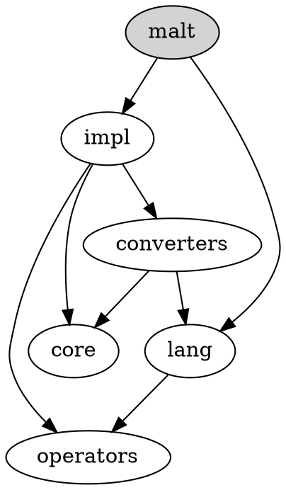

# How to contribute

We'd love to have your patches and contributions! Here are some guidelines. In general, we follow
the [PennyLane contributing guidelines](https://github.com/PennyLaneAI/pennylane/blob/master/.github/CONTRIBUTING.md), but have some
[DiastaticMalt-specific style guidelines](STYLE_GUIDE.md). More details below.

## Code reviews

All submissions, including submissions by project members, require review. We
use GitHub pull requests for this purpose. Consult [GitHub
Help](https://help.github.com/articles/about-pull-requests/) for more
information on using pull requests.

After a pull request is approved, we merge it. Note our merging process differs
from GitHub in that we pull and submit the change into an internal version
control system. This system automatically pushes a git commit to the GitHub
repository (with credit to the original author) and closes the pull request.

## Style

See the [DiastaticMalt style guide](STYLE_GUIDE.md).

## Unit tests

Please include unit tests when contributing new features
([example here](converters/continue_statements_test.py)), as they help to prove
that your code works correctly, and guard against future breaking changes to
lower the maintenance cost.

## Developer info

### Module structure

The graph below describes the dependencies between DiastaticMalt modules (not to be mistaken with the directory structure for these modules, which is flat):

`malt` is the sole user-visible module.

A short description of the modules:

 * `malt`: the main module imported by the user and by the generated code; only contains declarations
 * `impl`: high level code and the implementation of the api frontend
 * `core`: base classes for the DiastaticMalt source code transformation logic; see in particular `converter.py`
 * `lang`: special user-visible functions that serve as extensions to the Python language
 * `converters`: collection of source code transformation modules specialized for particular DiastaticMalt features
 * `operators`: collection of operators that DiastaticMalt overloads; these correspond to Python operators as well as Python syntactic structures, like control flow

There are two additional modules, `pyct` and `utils`. These are independent of DiastaticMalt:

 * `pyct`: a general purpose Python source code transformation library
 * `utils`: the kitchen sync; deprecated

Note: we have a long term plan to factor out an implementation of `impl` and `converters` that is
independent of autograph, into a general purpose Python operator overloading library.
